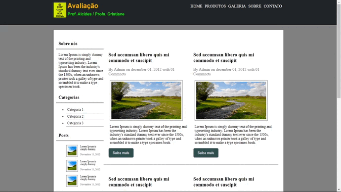

<h1 align="center">
    
    <p>Site em uma tela grande</p>
</h1>

<h1 align="center">
    
    <p>Site em uma tela pequena</p>
</h1>

---

## 📋Sobre
A atividade avaliativa foi um projeto dado pela minha professora Cristiane Pires Camilo com o objetivo de treinarmos para a prova.

---

## 🚀Tecnologias utilizadas

- [HTML5](https://www.w3schools.com/html/default.asp)

- [CSS3](https://www.w3schools.com/css/default.asp)

---

## 📁 Como baixar o projeto

```bash

# Clonar o repositório
$ git clone https://github.com/Dani2003G/atividade_avaliativa_1
# Entrar no diretório
$ cd atividade_avaliativa_1

# Instalar as dependências
$ yarn install

# Iniciar o projeto
$ yarn start

```